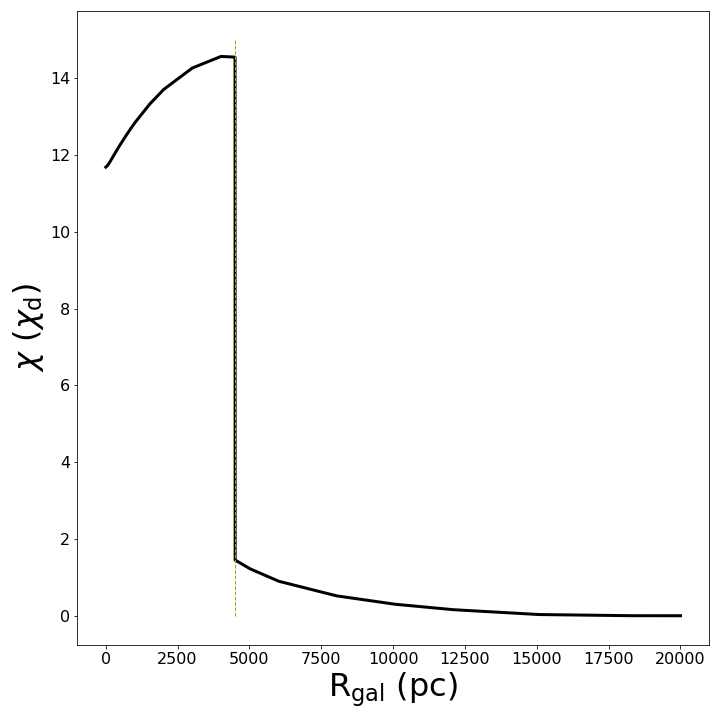
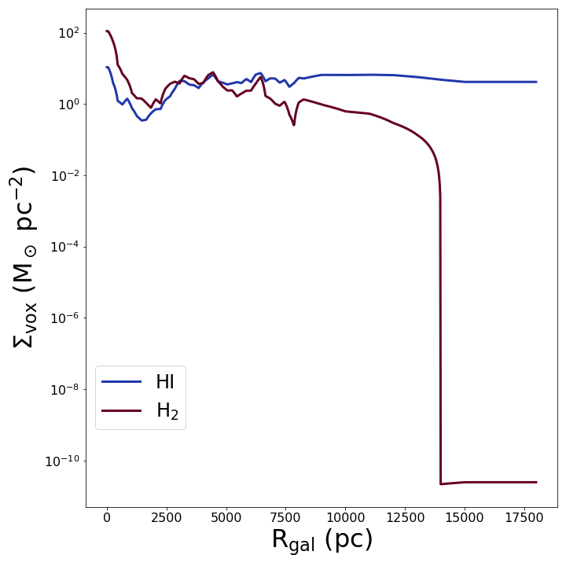
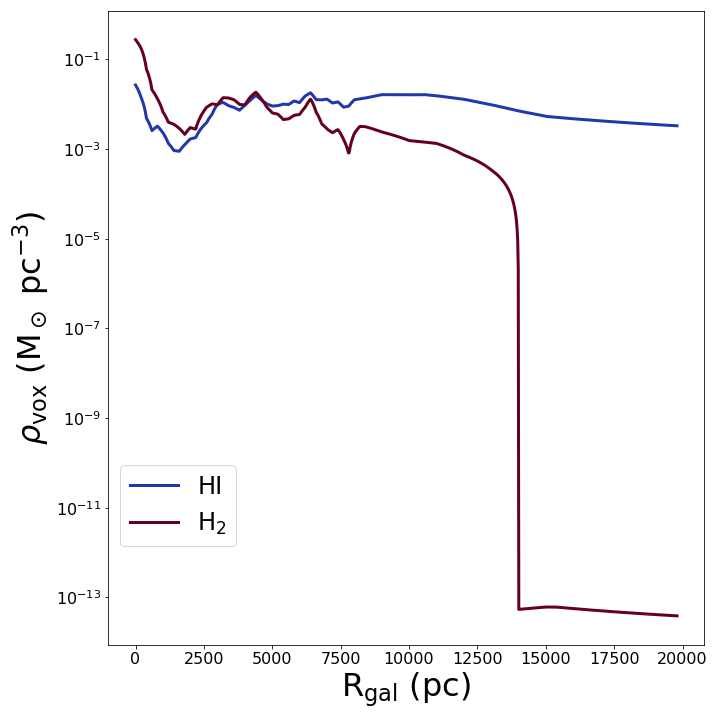

# Zermatt-Chile conference materials

This repository contains some additional material for my poster in the 2022
Zermatt-Chile conference.
A copy of the code can be pulled from [GitHub](https://github.com/CraigYanitski/kosmatau3d).
Here you can find additional information regarding the distributions used in my research.
For more information on the KOSMA-tau PDR model, see the poster by Aleena Baby.

## Profiles

- HI and H2 scale heights

- HI and H2 surface mass density distribution

- HI and H2 volume mass density distributions

- Far-UV radiation field

