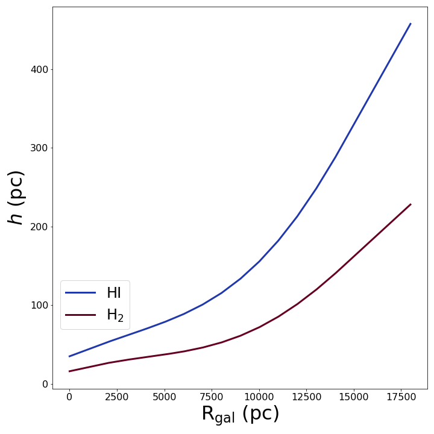
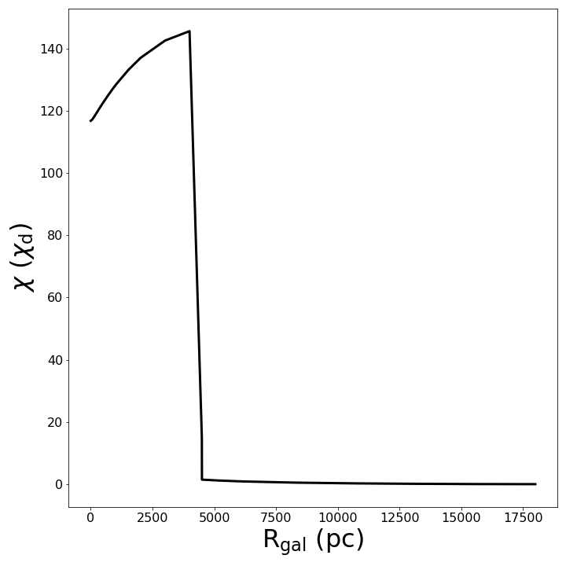

# Zermatt-Chile conference materials

This repository contains some additional material for my poster in the 2022
Zermatt-Chile conference.
A copy of the code can be pulled from [GitHub](https://github.com/CraigYanitski/kosmatau3d).
Here you can find additional information regarding the distributions used in my research.
For more information on the KOSMA-tau PDR model, see the poster by Aleena Baby
or her [website](https://aleenababy.github.io/projects.html).

## Profiles

- HI and H2 scale heights (Bacchini et al. 2019)

- HI and H2 surface mass density distribution (Bacchini et al. 2019 and Marasco et al. 2017)

- HI and H2 volume mass density distributions (calculated)

- clump surface hydrogen density (Wolfire et al. 2003)

- Far-UV radiation field (Popescu et al. 2011)

